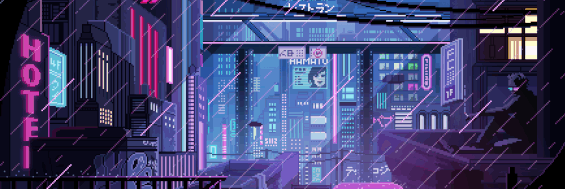

<!--  Create Beauty.\
 Explore Curiously.\
 Make Friends.\
 Spread Positivity.\
 Seek Understanding.\
 Fall in Love.
 -->
 Create Beauty. Explore Curiously. Make Friends.\
Spread Positivity. Seek Understanding. Fall in Love.   

###### hi friends! here is a bit about me:

```txt
* My name is Lanique
* Book I am currently reading:
  'The Chiffon Trenches: A Memoir' by André Leon Talley
* Fashion Design:
  - Former Fashion Designer for Nike
* Programming Interests:
  - Software Development
  - Extended Reality
  - Artificial Intelligence
* Passions + Ponders:
  - History
  - Sociology
  - Cooking
  - Meditation + Mindfulness
  - Design: Illustration, Graphics, Sewing...
  - Music: Rock, Classical, Folk, K-Pop, R&B, Pop...
```

<!--
✃Fashion Designer ⇄ Software_Developer

vi veri veniversum vivus vici
-->


[Click here to view my portfolio,](https://github.com/La-Nique/portfolio) which is still under construction... \
*(what can I say, I'm a studious developer & designer; I'm uninterested in using a template)*

<!--
**La-Nique/La-Nique** is a ✨ _special_ ✨ repository because its `README.md` (this file) appears on your GitHub profile.

Here are some ideas to get you started:

- 🔭 I’m currently working on ...
- 🌱 I’m currently learning ...
- 👯 I’m looking to collaborate on ...
- 🤔 I’m looking for help with ...
- 💬 Ask me about ...
- 📫 How to reach me: ...
- 😄 Pronouns: ...
- ⚡ Fun fact: ...
-->
